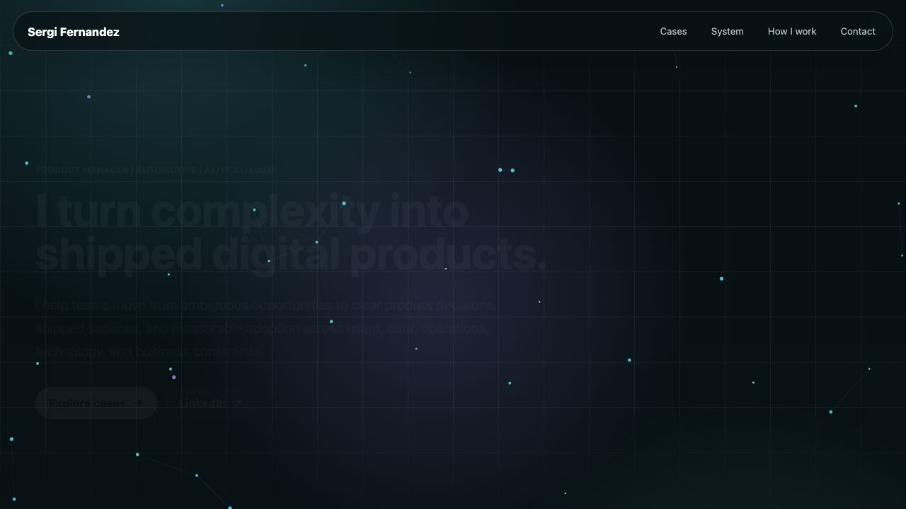

# Sergi Fernandez Portfolio

Personal product portfolio covering mobility, AI-assisted coaching, platforms, product adoption, and product operating systems.

Live site: [sergi-fernandez.github.io](https://sergi-fernandez.github.io/)



## Overview

This site is published from:

- Repository: `sergi-fernandez/sergi-fernandez.github.io`
- URL: `https://sergi-fernandez.github.io/`

There is intentionally no package manager, framework, or build step. Keeping the site static reduces maintenance cost and avoids deployment drift.

## Structure

- `index.html`
- `styles.css`
- `script.js`
- `assets/`

## Code Principles

- Preserve visual design, copy, routes, spacing, colors, and animations unless a visible bug is being fixed.
- Keep assets in `assets/` and reference them with relative paths so GitHub Pages can serve them directly.
- Avoid new dependencies unless the site gains enough complexity to justify a build tool.
- Treat files in `assets/` as public URLs. Do not delete or rename them unless all page references and external uses have been considered.
- Keep JavaScript progressive: decorative behavior should fail without blocking the content.

## Local Preview

From the repository root, run:

```sh
python3 -m http.server 8000
```

Then open `http://localhost:8000`.

If port 8000 is already in use:

```sh
python3 -m http.server 8001
```

## Checks

There is no package manager or build step for this repository. Before publishing, run:

```sh
node --check script.js
python3 -m http.server 8000
```

Then review the site locally in a browser and verify:

- the page loads without console errors
- all SVG mockups render
- desktop and mobile layouts have no horizontal overflow
- the mobile menu opens, closes, and updates `aria-expanded`
- anchor navigation still reaches `#cases`, `#system`, `#work`, and `#contact`

## Deployment

Push changes to `main`. GitHub Pages serves the repository root directly.

## Maintenance Rhythm

Update the site only when one of these changes:

- new role or title
- meaningful product launch
- public talk, article, or interview
- stronger metric for an existing case study

The goal is not frequent updates. The goal is a stable proof hub linked from LinkedIn.
